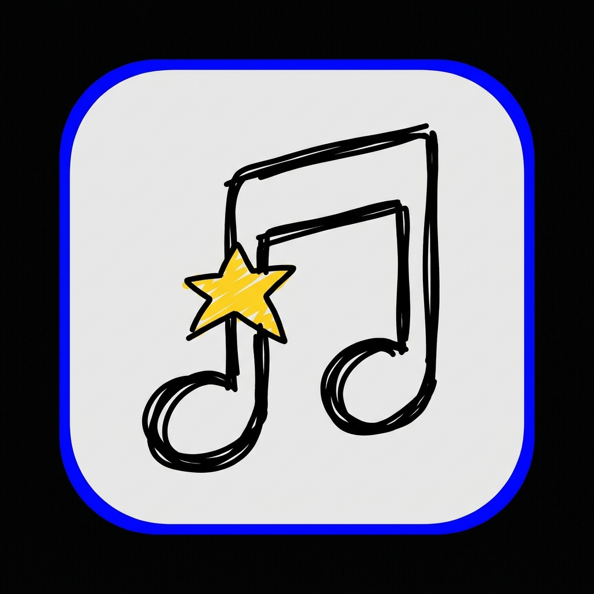

  

# SongCatcher.io 🎵 🚀

> Hear the beat. Catch the song.

**SongCatcher.io** is a high-octane, real-time multiplayer music guessing game. Compete with friends and music lovers worldwide to identify tracks from tiny audio snippets. The faster you catch it, the higher you climb!

---

## 🎮 Core Gameplay

### ⚡ The Progressive Challenge
Every round starts with a tiny **2-second** clip. If no one catches it, the clip length increases, giving you more clues but fewer points.

| Round Stage | Clip Length | Scoring Potential |
|---|---|---|
| 🏎️ **Fast Catch** | 2 Seconds | ⭐⭐⭐⭐⭐ (Max Points) |
| 🛡️ **Stable Catch** | 3-5 Seconds | ⭐⭐⭐ |
| 🐢 **Final Clue** | 8 Seconds | ⭐ |

### 🏆 Arena Features
- **Public & Private Lobbies**: Host your own Arena or join global matches.
- **Progressive Difficulty**: Songs get harder as the room gets more competitive.
- **Live Leaderboard**: Real-time rankings with MVP badges (Speed Demon, Hardcore).
- **Interactive Chat**: Quick-chat phrases and typing indicators to keep the vibe alive.

---

## 🌍 Music Categories & Eras
Choose your vibe and era to battle in your favorite genre:
- 🇮🇳 **Bollywood** (Retro Classics to Modern Hits)
- 🌾 **Punjabi** (Bhangra & Pop)
- 🇺🇸 **English / International** (Global Chart-toppers)
- 🗓️ **Decade Filtering**: Play hits from the **1950s** all the way to **2024**.

---

## 🌟 Daily Challenges
Test your skills against the world in the **Global Daily Arena**.
- **5 Mystery Songs**: Everyone gets the same songs every day.
- **Top 20 Rewards**: The top 20 players on the leaderboard earn **MusCoins** at 11:59 PM IST.
- **1st Place**: 💰 1000 MusCoins.

---

## 🪙 MusCoins & Economy
Earn **MusCoins** by winning matches and dominating the Daily Challenges.
- **Current Uses**: Earn and track your wealth on the global leaderboard.
- **Planned Marketplace**: Spend your coins on:
    - 🎭 **Custom Avatars** & Frame Borders.
    - 🎨 **Profile Themes** & Neon Effects.
    - 🔊 **Killstreaks** & Win SFX.

---

## 🛠️ Tech Stack & Optimization
- **Frontend**: Flutter (3.24+) with **Riverpod** for rock-solid state management.
- **Backend**: Firebase Firestore (Real-time DB) & Firebase Auth.
- **Audio**: `just_audio` with smart pre-loading and silence-offset detection.
- **UI Architecture**: **Neubrutalist Design System** — bold, high-contrast, and ultra-responsive.
- **Optimized**: High-frequency animations are isolated with `RepaintBoundary` for 60FPS gameplay on low-end devices.

---

## 🚀 Future Roadmap
- [ ] **Marketplace**: Fully functional shop for cosmetics.
- [ ] **Artist Battles**: Mode where you only play songs from your selected favorite artists.
- [ ] **Ranked System**: Competitive seasons with skill-based matchmaking.
- [ ] **Voice Rooms**: Real-time audio chat for private lobbies.
- [ ] **Achievements**: 50+ unlockable badges for milestones.

---

## 🤝 Community & Vision
SongCatcher is built for the community. Our vision is to create the ultimate social platform for music discovery and fandom competition.

**Catch the song before anyone else.** 🏆🎤✨
